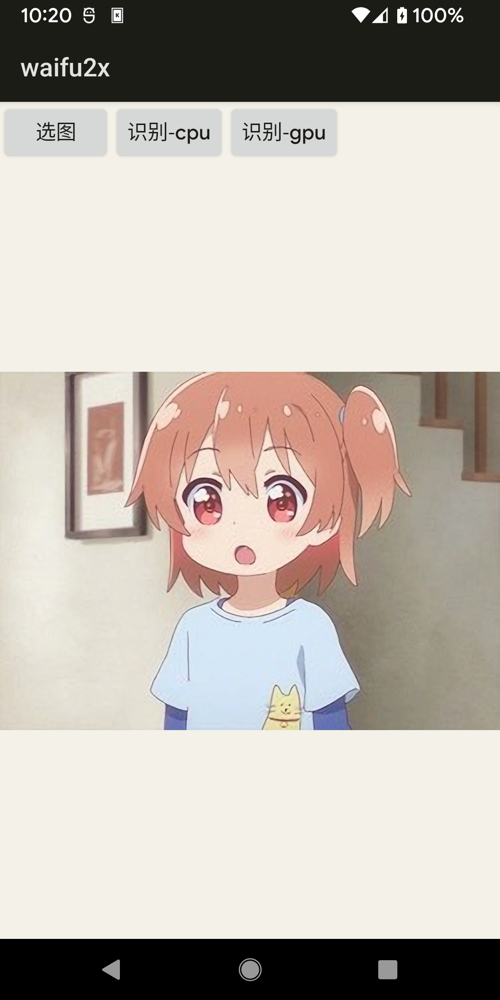

# waifu2x-ncnn-vulkan-android

## 介绍

这个项目是Waifu2x ncnn的第一个可工作版本,
最开始是以[ncnn-android-deeplabv3plus](https://github.com/runrunrun1994/ncnn-android-deeplabv3plus)为模板进行开发并参考了[ncnn-android-yolov5](https://github.com/nihui/ncnn-android-yolov5)的构建方法
. 同时，它的JNI和构建方法已经被更新为了现在Waifu2x ncnn所使用的版本。

我希望这个项目能够被其他的开发者用作参考资料，来做更多基于Waifu2x ncnn Vulkan，甚至是更多的ncnn项目的Android AI应用。

## 如何构建

和其他ncnn android样例项目差不多，只需要将合适的ncnn库放到 app/src/main/jni 即可。然而，在Waifu2x ncnn Android中，有两个可选的CMake
Flag，然后对应不同选项需要使用不同的ncnn库。这两个选项分别是： **USE_PREBUILT_NCNN** 和 **USE_SHARED_NCNN**。

| \ |USE_PREBUILT_NCNN=ON (默认)|USE_PREBUILT_NCNN=OFF|
|---|---|---|
|**USE_SHARED_NCNN=ON**|ncnn-android-vulkan-shared|ncnn (git repo)|
|**USE_SHARED_NCNN=OFF** （默认）|ncnn-android-vulkan|ncnn (git repo)|

要选择ncnn的构建类型，需要修改[app: build.gradle](app/build.gradle)的对应部分。

## 已知问题

- 有时候会没法构建成功 (比如， waifu2x.h cannot found VkVulkan syntex).

## 截图

## 致谢

我十分感激以下的人和项目。

- [nihui](https://github.com/nihui): 在项目非常早期的时候，帮助我解决了Waifu2x ncnn Vulkan JNI中的一个严重问题。
- [waifu2x-ncnn-vulkan](https://github.com/nihui/waifu2x-ncnn-vulkan): Waifu2x最开始的ncnn项目。
- [ncnn-android-yolov5](https://github.com/nihui/ncnn-android-yolov5): 提供了正确使用现今ncnn预编译打包的方法。
- [ncnn-android-deeplabv3plus](https://github.com/runrunrun1994/ncnn-android-deeplabv3plus):
  作为了做ncnn Android应用的模板。